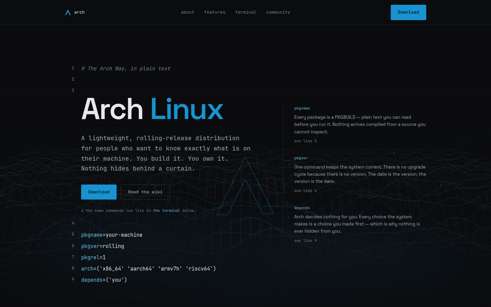

# Arch Linux — scroll landing page

**A man page you can scroll.**

A single-page landing surface for Arch Linux. The hero is a PKGBUILD. The backdrop
is a hand-written Canvas-2D projection. Everything else is type, rules and spacing.

**[Open the live site](https://lianbeast.github.io/Lian-Arch-Linux-Site/)** — deployed
to GitHub Pages on every push to `main`.

---

## What this is

An unofficial fan page, not affiliated with the Arch Linux project.

The design thesis is in `PRODUCT.md`: this is a technical document rather than a
landing page, and most layout decisions follow from that. Concretely:

- **The hero is a build recipe.** The headline sits on line 3 of a PKGBUILD and the
  last line is `depends=('you')` — the whole brand thesis as a dependency instead
  of a claim.
- **Rules, not cards.** Section structure comes from hairlines. There is no card
  component, no glassmorphism, and no glow anywhere on the site.
- **Four fonts, three roles.** Chakra Petch carries the hero headline alone;
  Space Grotesk does display and body; JetBrains Mono handles labels, meta strings
  and code fragments; Agave is terminal output only. Brand blue for links and
  active states, one green for terminal output, and nothing else.
- **No GPU work.** The backdrop is a 2D canvas with a hand-written projection
  (`src/components/ui/Backdrop.jsx`) — no WebGL, no three.js, no shader.

## Demo

<div align="center">
  
</div>

Click the terminal window, type a command, or hit a quick-command chip. `Tab`
completes a command, the arrow keys walk history, and `pacman -Syu` animates a
full upgrade. Every response is generated locally — nothing is fetched.

## Features

| Feature | Notes |
|---|---|
| PKGBUILD hero | Headline and thesis in one artifact. `SpecHero.jsx` |
| Interactive terminal | Ghost autocomplete, tab completion, arrow-key history, animated `pacman -Syu`. Fully local — no network |
| Live package search | Queries the official Arch index. See **Configuration** below |
| Sticky nav + active tracking | `IntersectionObserver`, debounced with `requestAnimationFrame` |
| Scroll progress | A hairline bar. Written straight to the DOM, never through React state |
| Reveal on scroll | Progressive enhancement — content renders visible if the API is missing |
| Animated backdrop | A fixed, site-wide landscape on a 2D canvas with a hand-written projection. No WebGL, no 3D library. One rAF loop, paused when the tab is hidden, static frame under reduced motion |
| Scroll-driven motion | Native CSS `animation-timeline`: section rules draw themselves in, the backdrop recedes as you read. Zero JS, compositor thread |
| Error boundaries | One per section, so a broken subtree degrades instead of blanking the page |
| Reduced motion | Handled globally in `index.css`, plus a static terminal fallback |

## Quick start

```bash
npm install
npm run dev        # http://localhost:5173
```

Production build:

```bash
npm run build      # → dist/
npm run preview    # serve the build locally
npm run lint
```

## Configuration

The package search needs a CORS proxy: `archlinux.org` sends no
`Access-Control-Allow-Origin` header, so a browser cannot call its API directly.

Copy `.env.example` to `.env.local` and set `VITE_PKG_API` to point at a proxy you
control — a Cloudflare Worker or a small serverless function is enough. Leaving it
blank falls back to the built-in default.

> **Known limitation.** The default proxy is a third-party service. That is the
> only external runtime dependency on this site, and the only piece that can fail
> for reasons outside this project. The search degrades to a link to
> archlinux.org rather than an empty box, but if this site matters, replace it.

## Project structure

```
src/
├── App.jsx                     # Composition only — the order of the argument
├── main.jsx                    # Entry: StrictMode + root error boundary
├── index.css                   # The entire design system
├── components/
│   ├── sections/               # One file per section
│   │   ├── SpecHero.jsx        # The PKGBUILD hero
│   │   ├── About.jsx           # Manifesto + facts line
│   │   ├── History.jsx         # Timeline
│   │   ├── Features.jsx        # Command rows
│   │   ├── Terminal.jsx        # Interactive shell
│   │   ├── PackageSearch.jsx   # Live Arch index search
│   │   ├── Download.jsx        # Images + USB commands
│   │   ├── Architectures.jsx   # Platform line
│   │   ├── UseCases.jsx        # Table
│   │   ├── Faq.jsx             # Native <details>
│   │   ├── Community.jsx       # Where to go
│   │   └── Footer.jsx
│   └── ui/
│       ├── Backdrop.jsx        # The animated canvas landscape
│       ├── ScrollProgress.jsx  # Hairline bar, written straight to the DOM
│       ├── Navbar.jsx          # Sticky bar + mobile menu
│       ├── BackToTop.jsx
│       ├── Tweaks.jsx          # Compact-mode toggle
│       ├── SectionHead.jsx     # Shared section header
│       ├── ErrorBoundary.jsx
│       └── Icons.jsx           # The official Arch mark
├── hooks/
│   ├── useActiveSection.js     # Which nav item is current
│   ├── useReveal.js            # Scroll reveal, as progressive enhancement
│   └── usePrefersReducedMotion.js  # Live matchMedia subscription
└── utils/
    └── constants.js            # Section order — single source of truth
```

## Stack

| Layer | Choice |
|---|---|
| UI | React 19 |
| Build | Vite 8 (Rolldown) |
| Backdrop | Canvas 2D, hand-written projection — no WebGL, no 3D library |
| Layout | CSS Grid; component breakpoints via `@container`, not `@media` |
| Fonts | Chakra Petch + Space Grotesk + JetBrains Mono + Agave, self-hosted |
| Lint | ESLint 10, flat config |
| Runtime deps | `react`, `react-dom` — that is all |

## Maintenance

**One command sweeps the leftovers.** The rewrite orphaned a handful of files that
nothing imports and nothing references — a generated video clip, a font weight the
site never uses, and two directories of agent tooling. They do not reach the
bundle, but they do reach the reader, and a dead file is how the next person ends
up confused about which asset is real.

```bash
bash scripts/cleanup-dead-code.sh
npm install
```

Then confirm the dependency tree is down to two runtime packages:

```bash
npm ls --depth=0
```

The script only removes files that are provably unreferenced. It prints each one
before it goes, and it is safe to run more than once.

**`demo.png` and `demo.gif` must live in `public/`.** The Open Graph and Twitter
card tags reference `demo.png` by absolute URL, and this README embeds `demo.gif`;
both need stable, unhashed paths. If they sit in the repo root, Vite fingerprints
them into `dist/assets/…` and the references 404. `public/` files are copied
verbatim, so the paths stay predictable.

**`demo.gif` is a screenshot, and it goes stale.** It is the inline demo above
(the social preview card is `demo.png`), so it is the first thing anyone sees
when this link is shared. The file currently in the repo predates the rewrite: it shows the old
cyan-on-black hero, the pill nav and the "A distro that gets out of your way"
headline. None of those exist any more, and cyan-on-black is the one palette
`PRODUCT.md` names outright. **Re-shoot it before the next release.**

1. `npm run dev`
2. Record the terminal running `pacman -Syu`, then `neofetch`.
3. Export at ~1000px wide, keep it under ~1 MB, drop it at `public/demo.gif`.

Social crawlers use the first frame, so make the first frame the thing you want
seen — right now that frame is the hero, which is why `og:image:alt` describes
the page rather than a command. Twitter/X frequently ignores animated images for
`summary_large_image`, so a static PNG for `og:image` is worth considering, with
the GIF kept for this README.

**The backdrop is drawn live, not played back.** `Backdrop.jsx` renders a fixed,
site-wide landscape on a 2D canvas — a flowing wireframe terrain with drifting
nodes above it — using a hand-written projection. No WebGL, no three.js, no
shader; the dependency count is unchanged. It deliberately draws no logo or
letterform: the official Arch logo is the only mark that represents the project.

Two earlier versions were abandoned, and both are worth recording:

- A **generated video clip** — a pre-rendered clip cannot rotate continuously. It
  has to loop, and every loop shows a seam.
- A **hero-scoped rotating ridge** — correct in itself, but the requirement was a
  background for the whole site, not for one section.

`scripts/cleanup-dead-code.sh` removes both, along with the clip. Until you run
it they still ship in `dist/`, because everything in `public/` is copied verbatim
whether or not anything references it.

Reduced motion and touch devices get a **single static frame** — the full
atmosphere with nothing moving. The scene recedes to 45% once you are a viewport
into the document. Geometry and every tuning knob are in
[`docs/backdrop.md`](docs/backdrop.md).

**Scroll-driven animations need a modern engine.** `animation-timeline` is in
Chrome/Edge 115+ and Safari 26+, and not yet in Firefox. Everything scroll-driven
is wrapped in `@supports` with the **finished** state as the base style, so
unsupported browsers render the complete static design — no half-drawn rules, no
missing content. Nothing to configure; it is a progressive enhancement by
construction. If the rules ever look wrong on a real viewport, the tuning knob is
`animation-range` in the scroll-driven block of `src/index.css`.

**When editing `PRODUCT.md`:** it is the design contract, and it must describe the
site that actually ships. If you change the fonts, the palette, the section list
or the type stack, update it in the same commit.

**`opendesign/` is a historical archive, not documentation.** It holds the six
original hero mockups and a UI-kit snapshot built on the *previous* design system
(cyan on black, glow, five font families). It is excluded from lint and from the
build, and it describes a site that no longer exists. Keep it as design history if
that is useful to you, or delete it — but do not read it as a description of
current behaviour.

## Fonts

Four families, all self-hosted in `public/fonts/`, zero CDN:

| Face | Weights | Role |
|---|---|---|
| Chakra Petch | 600 | `.hero-title` only — see `--font-hero` |
| Space Grotesk | 400 / 500 / 600 | display and body |
| JetBrains Mono | 100–800 (variable) | labels, meta strings, code fragments |
| Agave | 400 | terminal output only |

Chakra Petch is SIL OFL 1.1, latin subset only — the headline is Latin, so the
other subsets would be dead weight. To re-fetch or update it:

```bash
curl -L -o public/fonts/ChakraPetch-SemiBold.woff2 \
  https://cdn.jsdelivr.net/npm/@fontsource/chakra-petch/files/chakra-petch-latin-600-normal.woff2
```

`--font-hero` in `src/index.css` lists Space Grotesk after Chakra Petch, so a
missing file degrades the headline to the previous design rather than to a system
sans. `index.html` preloads it, because it is the largest thing above the fold.

## Deployment

Pushes to `main` deploy to GitHub Pages. `vite.config.js` sets `base: './'` and
`index.html` resolves assets through `%BASE_URL%`, so the build works from a
project subpath without further configuration.

### Build output you can ignore

```
./fonts/SpaceGrotesk-Regular.woff2 referenced in ./fonts/SpaceGrotesk-Regular.woff2
didn't resolve at build time, it will remain unchanged to be resolved at runtime
```

One of these per font, on every build. It is expected, not a defect.

`%BASE_URL%` expands to `./`, so the `@font-face` URL becomes
`./fonts/SpaceGrotesk-Regular.woff2`. Vite sees a relative `url()` it cannot
resolve from the HTML file and says so — but the file is in `public/`, so it is
copied to `dist/fonts/` verbatim and the browser resolves `./fonts/...` against
the document URL at runtime. That is the correct result; Vite is just narrating.

**To silence it properly**, move the fonts out of `public/` and into
`src/assets/fonts/`, then declare `@font-face` in `src/index.css` with relative
URLs. Vite will fingerprint them and rewrite the URLs. The trade-off is that
fingerprinted filenames cannot be referenced from the `<link rel="preload">` tags
in `index.html`, so you lose the above-the-fold font preload — which is why the
current setup keeps them in `public/` instead.

